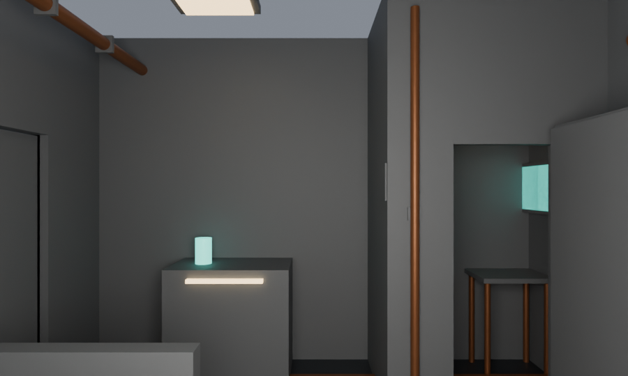
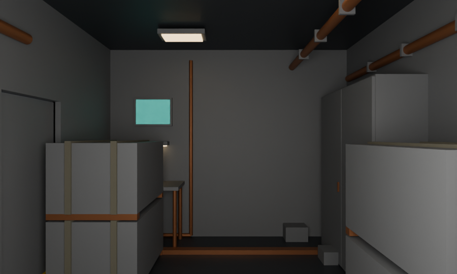
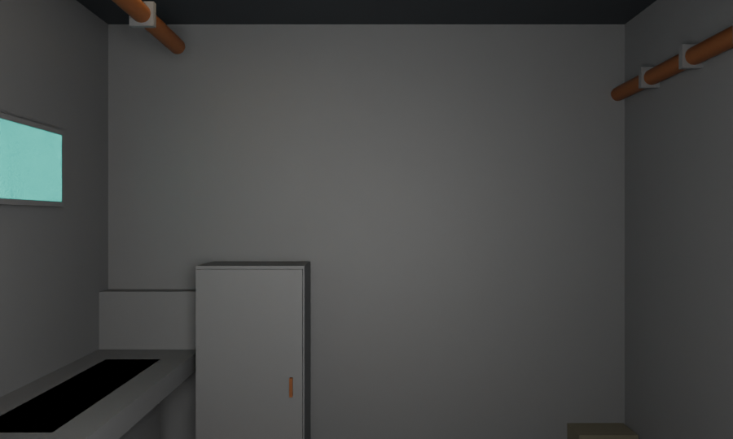
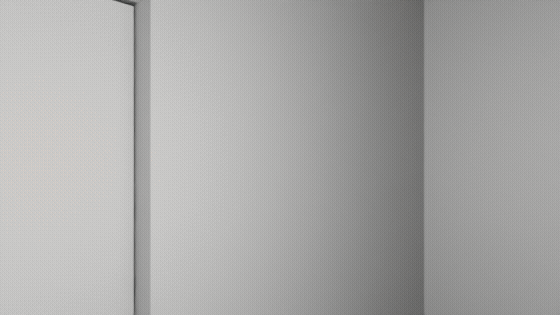
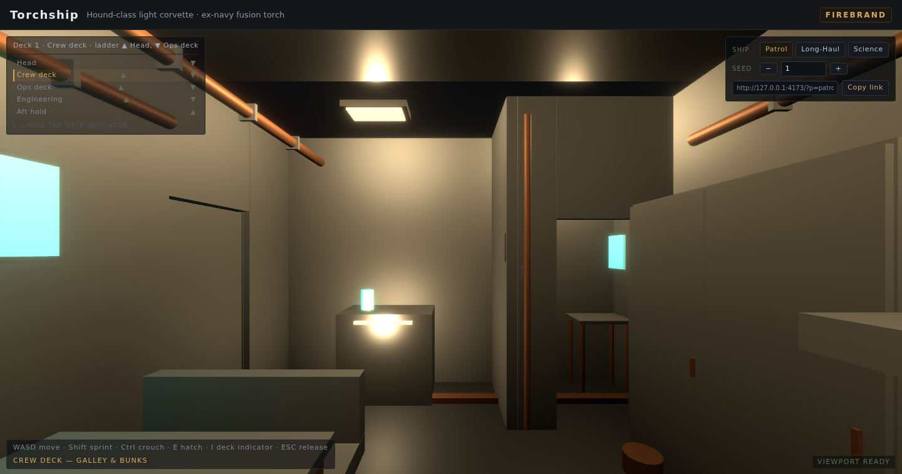
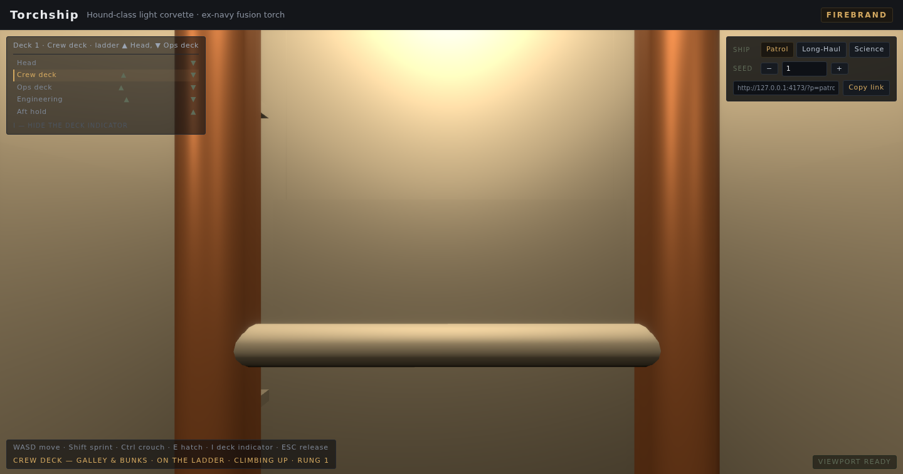
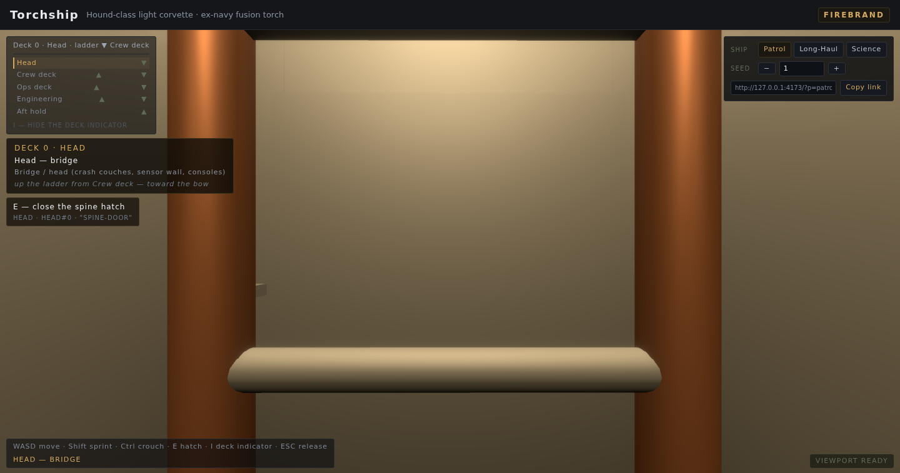

# Torchship

A walkable interior of an ex-navy fusion-torch corvette — Roci-inspired, original design.
First-person walkthrough under thrust gravity: decks stacked along the thrust axis, practical-only
lighting, worn and lived-in. Built with Vite + TypeScript + React 19 + React Three Fiber.

See `PRD.md` for requirements and `BUILD_PLAN.md` for the task plan (M0 spike & fixtures →
M1 contracts → M2 module kit → M3 assembler & vertical nav → M4 lighting → M5 review loops →
M6 export & launch).

## Dev

```bash
npm install
npm run dev          # Vite dev server
npm run verify       # the machine gate: lint + format:check + typecheck + test + build
npm run check:slots  # material-slot completeness gate (also runs first in `npm run build`)
npm run check:kit    # kit harness (M2 machine gate) — see "Kit harness" below
```

## Kit harness

`src/kit/harness/` is the M2 machine gate as executable data. `runKitHarness()` reports, per
authored module: manifest/authoring integrity, the contract diff against the fixture-time kit
(door sockets with per-axis millimetre residuals), every §4 slot the geometry draws resolving in
the ship's theme, and — walking the module's own render tree, pinned against a real react-dom
render of the same components — one mesh per part with the geometry, slot and transform the part
list describes. `npm run check:kit` runs it; `assertKitHarnessClean()` is the throwing form.
`StandaloneModuleScene` renders one module alone (the harness's composition surface).

CI (`.github/workflows/ci.yml`) runs the machine gate on every push to `main` and every pull
request — lint/format/typecheck/material-slots, then vitest, then the Vite build. An unassigned
material slot fails the build (PRD §7): the §4 slot vocabulary lives in `src/types/materials.ts`,
the theme registry and its completeness gate in `src/materials/`.

> The workflows are parked under `ci/`, not `.github/workflows/`: GitHub rejects any push that
> creates `.github/workflows/*` unless the credential carries the `workflow` permission, and this
> machine's token is a classic `repo`-scope PAT (see `~/notes/github-token-strategy.md`). From a
> workflow-scoped credential, activate CI with `git mv ci/github-actions-ci.yml
> .github/workflows/ci.yml` and the Pages deploy with `git mv ci/deploy-pages.yml
> .github/workflows/deploy-pages.yml` (and set Pages source = "GitHub Actions"). Until then CI does
> not run, the demo is not published, and `npm run verify` is the gate.

## Seams (M3-T2)

Every joint's mating geometry is generated from the door sockets themselves — never freehand
(`src/assembler/seams.ts`). A **sleeve** (the contact annulus between two mating wall faces,
extruded across the seam) seals each join; a **plug** (cut from the socket's opening, lapped onto
the wall and measured against the wall it sits in) closes every blanked socket a module does not
already hatch. The pass measures itself — gap against the 2 mm watertight cap, coverage of the
annulus, bite past both wall planes, and a clear pass-through — and that measurement is the PRD §8
bullet 1 `[auto]` invariant (`seams-watertight`, live at M3-T2 in the M0-T6 harness via
`checkSeamsWatertight`). `seamTally()` / `seamsWatertightProblems()` are the report surface.

## Draw calls (M3-T7)

The deck geometry partition the assembler emits (`groups` = merged per-slot geometry, `batches` =
instanced moulds) is exactly the draw-call plan: `src/player/deckGeometry.ts` builds ONE merged
`BufferGeometry` per group and ONE mould + placements per batch, and `ShipInterior`
(`src/player/WalkthroughScene.tsx`) mounts one mesh / one `InstancedMesh` for each. Before M3-T7
the decks were drawn one mesh per part (736 calls on Patrol); now Patrol draws **186 calls for 772
parts** (the M4-T4 worn detail included), Vagabond 221, Surveyor 185, the QA rig 204 — all under the
PRD §10 ceiling of **250** (`DRAW_CALL_CEILING`, `src/assembler/drawCalls.ts`). `drawCallTally()` /
`drawCallProblems()` are the report surface, the ceiling is checked by the assembler gate (rule 12),
and the numbers above are pinned on every deck of all four ships in
`src/assembler/drawCalls.test.ts` + `src/player/deckGeometry.test.ts` (which also proves each
instanced mould + placement reproduces its world part, so the swap cannot move geometry). The
`minInstances` assembler option is the one knob that trades calls for instancing; `wearDensity:
'off'` is the other, and it reproduces the pre-M4-T4 numbers (Patrol 736 parts / 179 calls).

## Material sets (M4-T1)

`src/materials/pbr.ts` authors the **nine PBR sets** — one per §4 slot — that the theme's slot
payloads resolve to: diamond-pattern deck plate, brushed/scuffed painted steel, copper-and-rust
pipe runs, recessed practical-light lenses, glass/acrylic screens, worn hazard striping, ceramic
heat shielding, canvas webbing, and the single warm accent reserved for the coffee station. A set
carries exactly what `meshStandardMaterial` spends (base albedo, metalness, roughness, plus an
emissive tint + strength for the light slots); worn-ness lives in `roughness`, bounded by
`PBR_MIN_ROUGHNESS` ("no gloss", PRD §4) and `PBR_EMISSIVE_INTENSITY_MAX` ("no blown-out panels").
The gates now check resolution as well as assignment: `themeProblems` fails the build on a set id
the registry does not know or one declared for another slot, and `npm run check:slots` asserts the
registry covers every slot exactly once. `src/kit/render/slotSurfaces.ts` is the slot → shading
bridge (theme-driven, no colour left in the kit) and `materialSetReport(ship)` reports per-slot
parts + draw calls for an assembled ship. Measured: all four canonical ships draw **9/9 slots**
(Patrol 772 parts / 186 calls shaded from theme `firebrand`).

## Practical lighting (M4-T2)

PRD §4 allows **no sun and no sky**: every lumen comes from a panel, a task strip, a screen or the
reactor. `src/lighting/archetypes.ts` authors exactly those four `LightKind` recipes — and they are
physical, not taste. Each names the §4 lens slot the fixture is *drawn* with, so a light's colour
IS that lens's emissive tint (resolved through the M4-T1 bridge: re-skin the panel lens and the
ship re-lights; an inert lens is refused); a designed throw, a target illuminance, and an intensity
**derived as `target × throw²`** in candela (three.js is physically correct, decay 2); a reach
bounded below by the throw and above by `MAX_LIGHT_RANGE_M`; and a shadow request only on task
lights (PRD §11 "small shadow maps only for task lights that matter"). `src/lighting/rig.ts` then
mounts **one fixture per authored light socket** of an assembled ship, in world space through the
same transform the geometry went through — nothing is hand-placed. The frame budget is a forward
renderer's: the rig is **deck-scoped** (`LIGHTS_ACTIVE_MAX` = 12 mounted at once, an over-budget
deck keeping landmarks and work lights before ceiling fill), and `lightRigReport(ship).activeMax`
is the number the M4 gate reads. Measured: Patrol **43 fixtures** (28 panel + 6 task + 8 screen +
1 reactor) over 5 decks, 10 mounted at once, 5 shadow-casting; Vagabond 51, Surveyor 44. The one
fill is warm and dim (`#4a443c` @ 0.28) and capped, so it can never flatten the interior.

## Worn detail (M4-T4)

`src/wear/` is the pass that makes the ship read as *lived in* (PRD §4 mood, §6 seed control):
**paint patches**, **cable routing** and **floor clutter**, authored once in `recipes.ts` as a small
vocabulary and GENERATED per ship from `ShipSpec.seed` (mulberry32 + an FNV-1a stream per deck /
module / facet — the same seed always yields the same ship, a different seed a different one).
Nothing is freehand (rule 8): a patch is painted on a `bulkhead` panel the module already draws, a
cable drops from one of the module's own light sockets down a wall it already has, and a prop rests
on the deck plate against that wall — `mounts.ts` derives every surface from the module instance,
and `checks.ts` RE-MEASURES the emitted world geometry (mounted/touching, inside its module, clear
of foreign kit + seam geometry and of every doorway's keep-clear zone, solid, and under the M3-T4
walk-over step so clutter is stepped over rather than walling the ship off). It draws only the nine
§4 slots and never the reserved `coffee-accent`. The gate (`wearProblems`) rides the assembler as
**rule 13** and is empty on all four canonical ships. Density is PRD §10's fourth degradation rung
(`AssembleOptions.wearDensity`: `full` → `reduced` → `off`, the last being the pre-M4-T4 ship and
the baseline the pass's cost is measured against): Patrol's 29 plans / 36 parts cost **7 draw
calls** (186 with the pass, 179 without; per-deck ≤ the 8-call budget), and `wearReport(ship)` prints
the whole ledger.

## Wayfinding UX (M5-T1)

`src/wayfinding/` is the deck/wayfinding UX (BUILD_PLAN M5-T1, PRD §8's "deck-order logic is
legible" / §11 risk 1 — a metal interior that reads as sameness). Three pieces, all DOM over the
canvas (never three objects), all derived from the assembly so a sign can never drift from the ship:

- **Per-deck label moments** (`moments.ts`) — the sign raised on a deck transition (the first report
  of a session, a climb arrival, a fall): `DECK 1 · Crew deck`, the deck's own spec label, what is
  aboard it (the modules' own kit-manifest labels) and how you got there, in the ship's own
  direction — decks descend nose → aft in index and Y, so a LOWER index is **up** under burn
  (`up the ladder from Ops deck — toward the bow`). It holds `MOMENT_HOLD_MS` (4 s) and clears.
- **Optional deck indicator** (`indicator.ts`) — the whole ship as one stack, bow at the top, the
  walker's deck flagged, and ladder marks (▲/▼) taken from **M3-T5's own run list**, so no row
  promises a climb the ship cannot make. Toggled with **`I`** (`INDICATOR_TOGGLE_KEY`) — optional by
  key, on by default.
- **Hatch affordances** (`affordances.ts`) — the prompt names the hatch in reach *and what E will
  do* (`E — open the spine hatch` / `E — close the spine hatch`), from the hatch's own record and
  the new `hatchPromptOpen` field the rig reports (`NavStep.hatchPromptOpen`, `WalkReport`). The
  reach test stays `hatchInReach` — the one the state machine uses — so the prompt can never name a
  hatch E would not act on.

`wayfindingProblems(ship, world)` (`checks.ts`) is the product gate — every deck has a name and a
room to name, the stack covers every deck in ship order with exactly one current row, every ladder
mark is backed by a run, and every hatch has a unique id and the right verb for its state. It is
empty on all four canonical ships (the QA rig's defects are geometry, never wayfinding) and is NOT a
§8 verdict (the M4-T2/T4 precedent).

## Review Loop (M5-T3)

`src/review/loop.ts` runs PRD §14 as a pass over the three M0 canonical ships + the stress spec
(BUILD_PLAN M5-T3). It derives nothing itself — it is the consumer of every gate the earlier
milestones built, and it ranks what they find:

| Checklist item | Gate it runs | Severity of a finding |
|---|---|---|
| Ship Spec valid | M1-T3 validator (authored kit) | sev-1 |
| PRD §8 [auto] invariants | M0-T6/M1-T3/M2-T7/M3–T4 harness (all six live) | sev-1 |
| Assembled-ship integrity | M3/M4 assembler gate (partition, seams, hull, draw calls, wear) | sev-1 (draw-call/clutter budget → sev-2) |
| Scripted walk (coffee run) | M5-T2 recorder + `walkProblems` | sev-1 |
| PRD §4 landmarks present | `landmarks.ts` (equipment anchors off the module manifests) | sev-1 |
| Practical lighting (no dark room) | M4-T2 `lightRigCoverageProblems` + the frame budget | sev-1 / sev-2 |
| Post processing within budget | M4-T3 `postProblems` | sev-2 |
| Deck-order legibility | M5-T1 `wayfindingProblems` | sev-2 |

Every defect is logged in PRD §14's shape `{ severity, ship, deck, location, repro }`. The exit rule
is **zero sev-1; ≤ 5 sev-2** per shippable ship. The stress rig is the **negative control**: it is not
a shippable ship, so the loop *requires* it to fail (≥ 1 sev-1) — a rig the loop signs off would mean
the loop is not looking. Measured: Firebrand/Vagabond/Surveyor 0 sev-1 / 0 sev-2 (exit rule met); the
rig 23 sev-1 / 1 sev-2 (its seeded reject cases all surface through the loop's own checks).

- `landmarks.ts` — the §4 landmark list as data: each landmark names the kit module type and the
  equipment-slot ids (off the M2 manifests) that prove it, so a module that stops authoring an anchor
  makes the landmark go missing here too; the spine is judged as a band on every deck + a climbable
  run.
- `loop.ts` — `reviewShip(fixture)` / `reviewLoop(fixtures?)` return the structured log; `loopProblems`
  is the loop's own verdict (every shippable ship passes; the control fails).
- `qa.ts` — renders the log to **`QA.md`** (PRD §14 step 5) and keeps the file honest: the golden test
  regenerates it on drift, exactly like the M1-T3 preset files. Run `npm run qa:review` for a focused
  pass.

The three §8 [review] items that need a human eye (worn-and-warm mood, the fresh-player hallway test,
onboarding time) are reported as **open human sign-off** items in `QA.md` — never quietly passed. The
loop is a product gate, not a §8 verdict (the M4-T2/M5-T1 precedent); M5-T4 owns the fix loop.

## glTF export (M6-T1)

`src/export/` is the export contract (PRD §7 "scene → glTF"; §13 "the glTF interior loads in
Blender with material slots intact and deck groups named per contract"). `exportGltf(assembly)`
serialises an assembled ship with three.js's own `GLTFExporter`, run on the scene
`buildExportScene` builds **from the M3-T7 draw plan** (`src/player/deckGeometry.ts`) — so the
exported tree is the tree the walker walks:

- one `Group` per deck, named **`deck-0 … deck-N`** (nose → aft), placed at the deck floor
  `[0, floorY, 0]`, its geometry baked into the group's local frame;
- one `Mesh` per merged material group and one `InstancedMesh` per instance batch, named by the
  scene graph's own ids (`EXT_mesh_gpu_instancing` carries the batch placements);
- one shared `MeshStandardMaterial` per §4 slot the ship draws, **named by the slot** (the M4-T1
  `slotSurface` path — re-skin the theme and the export re-skins), so "material slots mapped to
  named export materials" is data.

Units are meters and the axis is stated by the hierarchy (deck floors descend in Y → thrust axis
**−Y**); the contract also travels in `asset.extras` (`units` / `upAxis` / `thrustAxis`).
`exportProblems(gltf, assembly)` validates a serialised document headlessly — deck groups, floors,
unit scale, named slot materials, one mesh node per draw call, and **transform fidelity**: every
instanced batch's TRANSLATION accessor is the batch's own placements and every merged group's
POSITION bounds are its geometry's own bounds (deck-local, meters), so the serialised numbers can't
drift from the assembly. `assertExportValid` is the throwing form; `npm run test` exercises the
whole pass on all four canonical ships (and injects drift to prove the checker). No WebGL and no
dev server: three's exporter is CPU-side for geometry with no textures (this project authors none).
M6-T3/T4 (download + deployed demo) consume this surface.

## Blender validation (M6-T2)

`src/export/blender.ts` is the consumer-shaped acceptance check for the export (BUILD_PLAN M6-T2:
"Validate export in Blender (materials intact, deck groups present, no flipped normals)"). It reads
the serialised document the way an importer does — scene → node → mesh → primitive → material /
accessor — and reports the three criteria as data, after first running the M6-T1 contract
(`exportProblems`):

- **deck groups present** (`deckGroupCheck`) — the scene roots are `deck-0 … deck-N`, in order, each
  carrying meshes;
- **materials intact** (`materialCheck`) — every referenced material resolves to a named §4 slot,
  one per drawn slot, each with a usable PBR payload (base colour / metalness / roughness) and
  emission on the slots the theme makes emissive;
- **no flipped normals** (`auditNormals`, `src/export/normals.ts`) — every triangles primitive's
  faces wind with their vertex normals (and normals are unit length).

`blenderValidation` / `blenderValidationProblems` / `assertBlenderValid` are the surface. The vitest
suite (`src/export/blender.test.ts`) pins all three clean on the four canonical ships and injects a
missing / renamed / empty deck group, a dropped / duplicated / renamed material, a lost emission, an
unlit PBR payload and inverted / non-unit / degenerate normals to prove the checks fire.

The real-Blender leg: `scripts/blender-validate.py` imports the written `.gltf` with Blender's own
glTF importer (the `bpy` module, headless) and asserts the same three claims, including per-polygon
winding-vs-corner-normal agreement. The corpus is written to `dist/export/` by the test suite:

    npm run validate:export                        # write dist/export/*.gltf + headless checks
    BLENDER_PYTHON=/path/to/bpy/python npm run validate:blender

Measured on Blender 5.0.1 (see `docs/export-validation.md`): deck groups present and ordered, the
nine §4 materials intact, and **0 flipped normals** across 6,184–7,260 polygons per ship.

## Share URL + autosave (M6-T3)

`src/share/` is the persistence layer (PRD §6.1: *"autosave of the selected spec + seed to
localStorage; shareable URL encodes spec + seed"*). A `ShareState` is the selected `ShipSpec` plus
the variation `seed` and the worn-detail `wearDensity` rung; `effectiveSpec` assembles
`{ ...spec, seed }` so the seed control is authoritative.

- **codec** (`codec.ts`) — `ShareState` ⇆ a query string. It is **preset-aware**: a canonical ship
  travels as `p=<preset>` (the spec already lives in the bundle — `p=patrol` is the whole default
  link), a custom hull as `s=<base64url JSON>` (UTF-8 safe, so em-dash deck labels survive). The
  decoder is **total and strict**: it returns `null` for an unknown preset, malformed base64, JSON
  that is not a Ship Spec, a spec the M1-T3 validator rejects (which is what keeps the negative
  stress rig out of links), an out-of-range seed, or an unknown wear rung — nothing throws.
- **storage** (`storage.ts`) — the autosave is *the same query string* under a versioned key
  (`torchship.share.v1`), so a link and an autosave can never disagree about the format. Denied /
  quota-full storage degrades to `false`/`null`, never an exception.
- **url** (`url.ts`) — `shareUrlFor` builds the link; `syncShareUrl` rewrites the address bar with
  `replaceState` (no history spam) and no-ops when the query already matches.
- **resolve** (`resolve.ts`) — boot precedence **URL → autosave → default preset** (Patrol); a
  malformed link is treated as absent so it falls back to the autosave. `applyShareState` persists +
  publishes in one call.
- **ShareControl** (`ShareControl.tsx`) — the DOM affordance (top-right of the viewport): the three
  presets, a seed stepper, and the copyable share link.

`Viewport` boots from `resolveShareState(window.location.search)` and, on any change, calls
`applyShareState` (autosave + address bar) and re-assembles the keyed scene, so the link always
reproduces exactly what is on screen. 57 tests (`share.test.ts`, `ShareControl.test.tsx`, and two
`Viewport.test.tsx` integration tests) cover the codec round-trips and rejections, the storage
autosave, the URL plumbing and the resolution precedence.

## Demo (M6-T4)

The app is a **client-only static site**: `npm run build` writes `dist/` and `npm run preview` serves it locally. The build uses the relative Vite base `./`, so the same `dist/` runs from a subpath (a GitHub Pages project site) as well as a domain root. `npm run deploy:check` validates a built `dist/` against the deploy contract — `index.html`, relative asset refs, the four preset JSONs, the favicon, and the JS/CSS bundle.

- **Demo:** https://jefhei.github.io/torchship/ (GitHub Pages (project site), served from `/torchship/`)

The picker ships the three real presets. Each interior below is a Blender render of the M6-T1 glTF export from that ship's own assembly (regenerate with `npm run demo:render`):

| Preset | Space | Interior |
| --- | --- | --- |
| Patrol | Crew deck — galley & bunks |  |
| Long-Haul | Cargo hold B — spares & workshop stores |  |
| Science | Science deck — expanded med bay & sensor suite |  |

The **coffee run** (crew deck → the coffee station → back) — replayed headlessly by the M5-T2 recorder and rendered frame by frame (24 frames at 12 fps):



### Live app frames

Captured from the running app itself (headless Chrome + software WebGL) — these are
_not_ Blender renders, so they show the practical lighting, bloom and HUD as they
actually appear in the browser:

**Crew deck — the galley at spawn**, under practical panel/task lighting with the
coffee-station landmark:



**Vertical navigation — mid-climb on the spine ladder**, the run that connects one
deck to the next:



**Wayfinding — the deck-transition moment on arrival**: the moment card names the
deck and how you got there ("up the ladder … toward the bow"), and the indicator
flags the head deck:



## Status

Tracked in `.hermes/status.json` (read FIRST) and `.task-progress.json`; both update after every
BUILD_PLAN task. Ship name locked at build start (rule 9): **Hound-class light corvette *Firebrand*** —
goes into the Ship Spec `name` field (M1-T2) and the share URL (M6).
